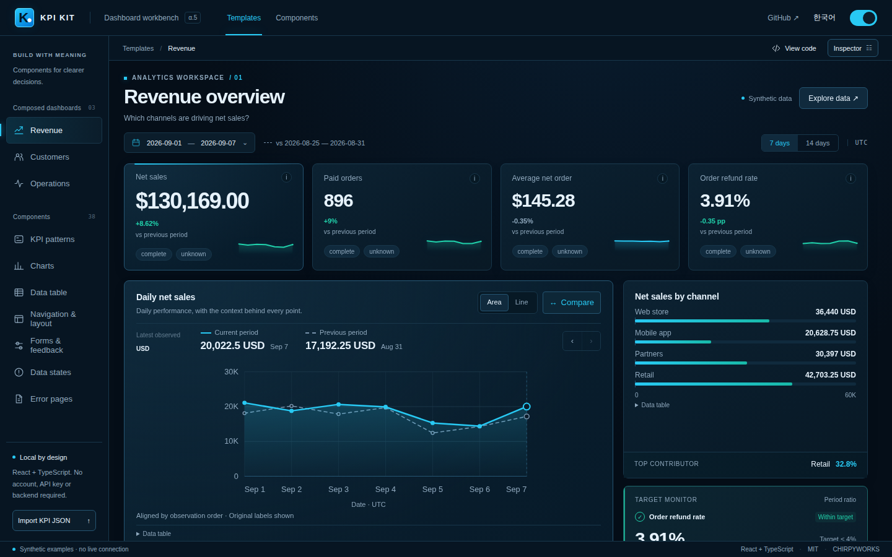

# KPI Kit

**숫자의 의미를 잃지 않으면서 빠르게 조립할 수 있는 오픈소스 React KPI·차트·테이블·필터·데이터 상태 키트입니다.**

**[Live Demo](https://chirpyworks.github.io/kpi-kit/)** · [English](README.md) · [컴포넌트 목록](docs/component-map.md) · [데이터 규격](docs/kit-contract.md) · [사용법](docs/kit-usage.md) · [현재 상태](docs/status.md)

[](https://chirpyworks.github.io/kpi-kit/)

매출 대시보드 · 다크 테마 · 합성 예제 데이터. 이미지를 누르면 라이브 데모로 이동합니다.

> **0.1.0-alpha.5 — 공개 알파.** 매출·고객·운영의 합성 대시보드와 독립 컴포넌트 예제를 제공합니다. 이 변경은 로컬 clean install, TypeScript, 테스트, 프로덕션 빌드로 검증했으며 실제 브라우저 렌더 검증은 별도 출시 조건입니다. [검증 현황](docs/verification.md)을 확인하세요.

## 왜 만들었나

많은 대시보드 스타터는 화면 모양부터 만듭니다. KPI Kit은 다음 의사결정 흐름을 먼저 고정합니다.

**범위 → KPI 의미 → 비교 → 시각화 → 상세 근거 → 데이터 상태**

BI 플랫폼을 만들려는 것이 아닙니다. 반복적으로 필요한 대시보드 부품을 빠르게 가져다 쓰되, 단위·비교 기준·누락·최신성·목표 의미를 숨기지 않는 소스 키트입니다.

계정, 백엔드, 데이터베이스, API 키, 텔레메트리, 유료 서비스가 필요하지 않습니다. 저장소의 예제 데이터는 모두 합성입니다.

## 포함된 구성

| 영역 | Alpha.5 |
| --- | --- |
| KPI | `MetricCard` 하나와 number, comparison, sparkline, target, status, compact 6패턴 |
| 차트 | Line, area, horizontal bar, vertical bar, grouped bar, stacked bar, waterfall, donut, bullet |
| 테이블 | 열 정의, 검색, 안정 정렬, 페이지 이동, 행/페이지 선택, 필터 결과 CSV, 선택 행 CSV |
| 컨트롤 | Button, Badge, Field, Checkbox, Switch, FilterChip, Tabs, Tooltip, DateRangeField, Dialog |
| 상태·오류 화면 | 로딩, 빈 데이터, 검색 결과 없음, 오류·재시도, 오프라인, 오래됨, 일부 수집; 403/404/500/점검 페이지 |
| 화면 조립 | 셸·헤더·사이드바, 경로, 상세 패널, 페이지 이동; 입력 검증, 선택·필터, 확인창, 알림 |
| 데이터 | 검증된 KPI 계약, 명시적 범위/단위/품질, 안전한 비교, 최신 요청만 적용하는 비동기 로더 |
| 작업대 | 뷰포트형 라이브러리 / 미리보기 / 설정·코드, 모바일 패널 탭, 한/영, 라이트/다크 |
| 예제 | 같은 기간 필터로 동작하는 매출·고객·운영 대시보드, 실행 가능한 컴포넌트 코드 |

차트 9개는 서로 다른 엔진 9개를 뜻하지 않습니다. 선/영역은 같은 시리즈 렌더러를, 그룹/누적 막대는 같은 멀티시리즈 계약을 공유합니다.

## 로컬 실행

Node 22.12+와 npm이 필요합니다.

```sh
npm ci
npm run dev
```

Vite가 알려주는 주소를 엽니다. `/index.html`은 전체 작업대, `/kit.html`은 컴포넌트 작업대로 바로 들어가는 경로입니다.

`package-lock.json`은 실제 npm 설치로 생성했으며 새 `npm ci` 설치로 확인했습니다. 의존성을 변경할 때는 npm으로 lockfile을 갱신하세요.

## KPI 부품 사용 예

```tsx
import { MetricCard, validateMetricView } from './kit/index.js';
import './kit/styles.css';

const metric = validateMetricView(rawMetric);

export function Overview() {
  return (
    <section className="kk-root">
      <MetricCard metric={metric} pattern="comparison" />
    </section>
  );
}
```

컴포넌트가 임의의 원자료에서 KPI 의미를 추론하지는 않습니다. 업무 계산은 연결하는 애플리케이션이 책임지고, KPI Kit은 결과의 계약을 검증하고 표현합니다.

## 숫자 의미를 지키는 기본 규칙

- 누락은 0이 아닙니다.
- 일부 수집은 완전한 총합이 아닙니다.
- 완전성과 최신성은 서로 다른 상태입니다.
- %p 변화와 상대 % 변화는 다릅니다.
- 기준값 0을 무한대 증감률로 만들지 않습니다.
- 목표 달성과 이전 기간 대비 개선은 다른 판단입니다.
- 낮을수록 좋은 지표에서는 감소가 긍정적일 수 있습니다.
- 시계열 누락 구간을 선으로 이어 붙이지 않습니다.
- 누적 막대의 음수는 모호하게 그리지 않고 거부합니다.
- 워터폴의 변화값이 누락되면 기말값을 만들어내지 않습니다.

정확한 범위는 [데이터 규격](docs/kit-contract.md)을 확인하세요.

## 검증

```sh
npm run typecheck:core
npm run typecheck:kit
npm test
npm run check:repository
npm run verify
```

브라우저 검증은 Python과 Playwright가 필요합니다.

```sh
python -m pip install -r tests/requirements.txt
python -m playwright install chromium
npm run test:kit
```

검증 워크플로는 실제 설치 경로를 검증하고 기술 증거를 짧은 기간 artifact로 보존합니다. 별도 Pages 워크플로는 `main`의 공개 데모를 빌드·배포합니다. npm 패키지는 발행하지 않습니다.

## 범위

KPI Kit은 호스팅 분석 서비스, 회계 원장, 인증 시스템, 완전한 앱 디자인 시스템이 아닙니다. MIT 라이선스의 GitHub 소스입니다.

`package.json`의 `private: true`는 실수로 npm에 발행하는 것을 막기 위한 것이며 MIT 소스 라이선스를 제한하지 않습니다.

실제 고객 데이터와 자격증명은 `public/`, 소스, 스크린샷, 이슈, 테스트 데이터에 넣지 마세요.

기여 전에 [CONTRIBUTING](CONTRIBUTING.md), [SECURITY](SECURITY.md), [third-party notices](THIRD_PARTY_NOTICES.md), [MIT 라이선스](LICENSE)를 확인해 주세요.
